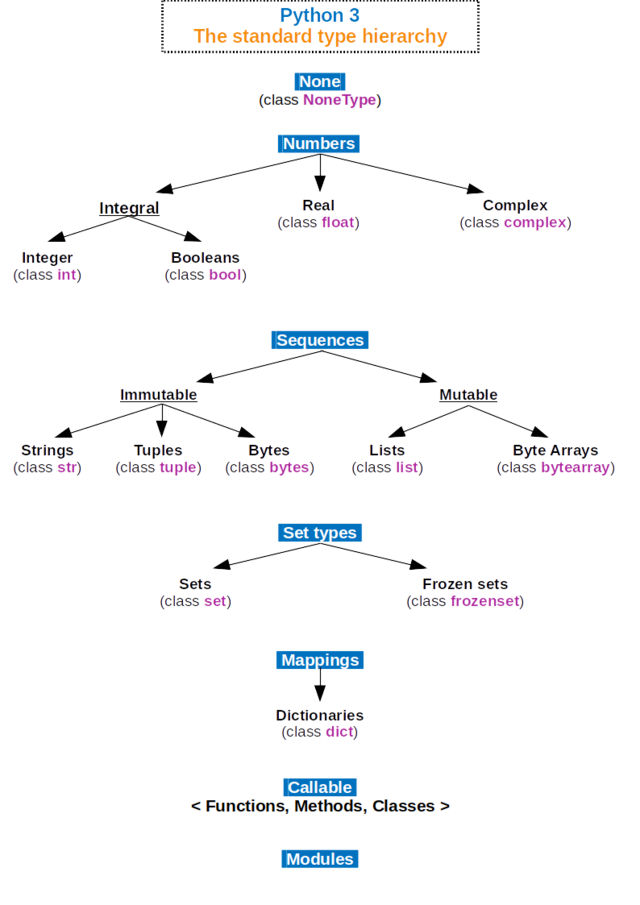

### install

* https://docs.python-guide.org/starting/install3/osx/

### data type hierarchy

### data-type compare

* [data type time complexity](https://wiki.python.org/moin/TimeComplexity)

| javascript      | python        | golang
| -------------   | ------------- | -------------   
| null            | None          | nil
| Uint8ClampedArray       | bytes           | bytes
| Number       | int/float           | int8/16/32 /float
| Array       | list           | slice,array
| object       | dict           |  struct
| pyproxy       | object           | int8/16/32
| Paragraph       | int           | int8/16/32       
